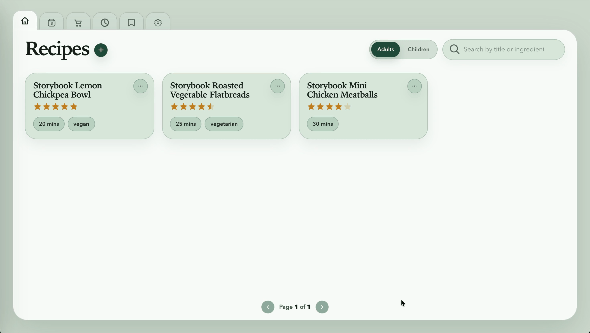
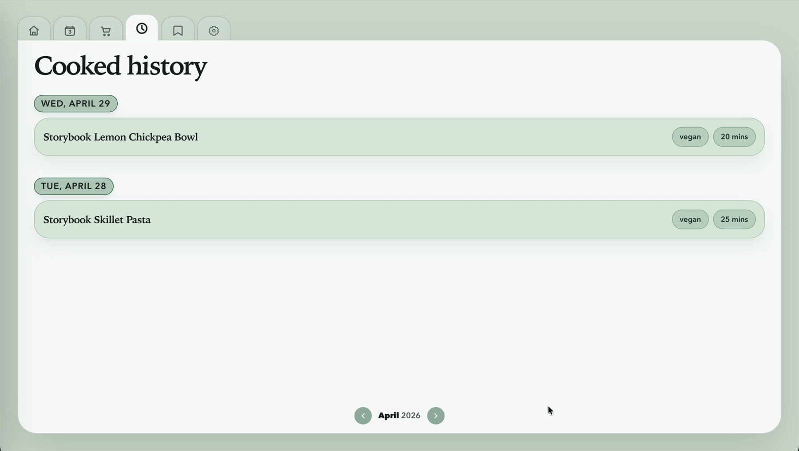
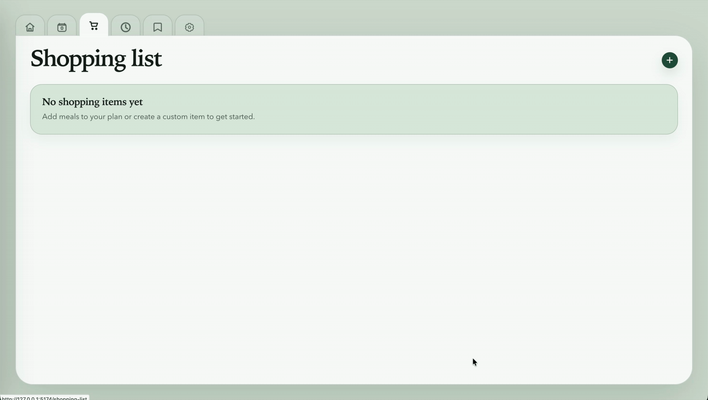
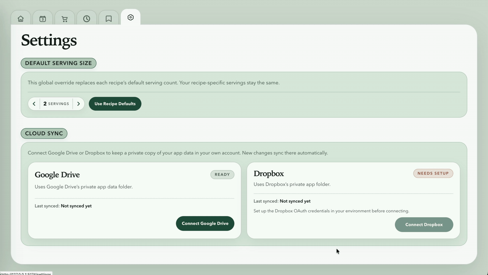

# Recipes

A local-first React + TypeScript recipe app for browsing recipes, saving bookmarks, planning meals, and managing a derived shopping list.

## Demo Mode

If you want to record the app with mock data, run:

```bash
npm run dev:demo
```

This seeds a separate `.recipes-demo/` persistence directory, leaves your real `~/.recipes/` data untouched, and starts the app on `http://127.0.0.1:5174`.

Use `npm run dev` to go back to your normal local data. To refresh the mock snapshot, run `npm run demo:seed`.

## Features

- Browse the recipe catalog with search, pagination, and adult/children audience tabs.

  
- Create and edit recipes from the recipes page, including ingredients, tags, nutrition, servings, and notes.

  
- Open recipe details with scaled ingredients, grouped method steps, nutrition, ratings, bookmarks, and optional step timers.

  
- Save text selections as bookmarks, search them later, and jump back to the source recipe.

  
- Add recipes to a date-based meal plan, move or remove entries, and mark meals as cooked.

  
- Review cooked history by month.

  
- Build a shopping list from the meal plan, check items off, and add custom entries.

  
- Set a global default serving size in Settings.

  

## Tech Stack

- React 18
- TypeScript
- Vite
- React Router
- Tailwind CSS v4
- Vitest
- Storybook

## Getting Started

This project expects Node 20 or newer.

```bash
npm install
npm run dev
```

Open `http://localhost:5173`.

## Docker Deploy

Every push to `main` builds a Docker image and publishes it to Docker Hub.

The workflow expects these GitHub secrets:

- `DOCKERHUB_USERNAME`
- `DOCKERHUB_TOKEN`

Images are tagged as:

- `latest`
- `main`
- `sha-<full commit sha>`

For Docker Compose, a service can track `latest` and keep the app state on a volume:

```yaml
services:
  recipes:
    image: your-dockerhub-user/recipes:latest
    ports:
      - "4173:4173"
    environment:
      RECIPE_PREFERENCES_DATA_DIR: /data/recipes
      RECIPE_PUBLIC_ORIGIN: https://recipes.example.com
      RECIPE_AUTH_ALLOWED_EMAIL: you@example.com
      RECIPE_AUTH_GOOGLE_CLIENT_ID: your-google-oauth-client-id
      RECIPE_AUTH_GOOGLE_CLIENT_SECRET: your-google-oauth-client-secret
      RECIPE_AUTH_SESSION_SECRET: a-long-random-string
    volumes:
      - recipes-data:/data/recipes
    restart: unless-stopped

volumes:
  recipes-data:
```

To refresh a running deployment, pull the new image and restart the service:

```bash
docker compose pull
docker compose up -d
```

The container already points `RECIPE_PREFERENCES_DATA_DIR` at `/data/recipes`, so mounting that path keeps recipe data between updates and container restarts.

If you serve the app from an external origin, set `RECIPE_PUBLIC_ORIGIN` to that exact origin so auth, cloud sync callbacks, and browser requests line up.

## Scripts

```bash
npm run dev            # start the Vite dev server
npm run demo:seed      # seed mock data into .recipes-demo/
npm run dev:demo       # seed mock data and start the demo server
npm run build          # type-check and create a production build
npm run preview        # preview the built app locally
npm run test           # run tests in watch mode
npm run test:run       # run tests once
npm run storybook      # start Storybook
npm run build-storybook # build Storybook for production
```

## Persistence

Runtime recipe state and user data live in a private storage directory outside the repo by default.

By default, persisted JSON files are written to `~/.recipes/` on the local machine. If that directory does not exist yet, the app creates it on first launch.

The app stores these JSON files there:

- `recipes.json`
- `meal-plan.json`
- `cooked-meal-history.json`
- `recipe-bookmarks.json`
- `recipe-notes.json`
- `recipe-ratings.json`
- `recipe-servings.json`
- `recipe-settings.json`
- `shopping-list-checks.json`
- `shopping-list-custom-items.json`

A local Vite middleware in `server/recipePreferencesApi.ts` serves `/api/*` routes and writes updates atomically. By default it only accepts localhost requests; if you set `RECIPE_PUBLIC_ORIGIN`, it will also accept requests from that single configured origin. Set `RECIPE_PREFERENCES_DATA_DIR` if you want to point persistence at another directory.

### Google App Sign-In

Set `RECIPE_AUTH_ALLOWED_EMAIL` to require Google sign-in before the app opens. Only that exact Google email address may sign in.

Create a Google OAuth web client, then set:

```bash
RECIPE_AUTH_ALLOWED_EMAIL=you@example.com
RECIPE_AUTH_GOOGLE_CLIENT_ID=...
RECIPE_AUTH_GOOGLE_CLIENT_SECRET=...
RECIPE_AUTH_SESSION_SECRET=...
```

Add this authorized redirect URI to the Google OAuth client:

- `https://recipes.example.com/auth/google/callback`

Use your real `RECIPE_PUBLIC_ORIGIN` in place of `https://recipes.example.com`. For local testing, use `http://127.0.0.1:5173/auth/google/callback`.

The app session is stored in a signed, HTTP-only cookie so mobile browsers should stay signed in across normal app focus changes. The auth client ID/secret can be the same OAuth web client used for Google Drive cloud sync, as long as both redirect URLs are configured.

### Offline Use

Production builds register a service worker and include a web app manifest. After you have opened the app online once, the browser caches the app shell plus successful API reads. The app also stores the last successful recipe catalog and app-data snapshot in browser storage, so the shopping list can still render when requests fail offline.

Offline changes are intentionally conservative: read-only access is cached, while writes still need the server to save and sync reliably.

### Cloud Sync

Settings can connect Google Drive or Dropbox for cloud sync.

Cloud sync is optional. To use it, create an OAuth app with Google and/or Dropbox, copy the app credentials into this project’s environment, and then connect the provider from Settings.

These are app credentials, not your personal Google or Dropbox password. The app uses them to open the sign-in flow and store files in your account.

1. Create an OAuth app:
   - Google: create an OAuth client in Google Cloud Console.
   - Dropbox: create an app in the Dropbox developer console.
2. Copy `.env.example` to `.env.local`, then fill in the client ID and client secret values:

   ```bash
   cp .env.example .env.local
   RECIPE_GOOGLE_DRIVE_CLIENT_ID=...
   RECIPE_GOOGLE_DRIVE_CLIENT_SECRET=...
   RECIPE_DROPBOX_CLIENT_ID=...
   RECIPE_DROPBOX_CLIENT_SECRET=...
   ```

3. Add callback URLs for the app origin:
   - `http://127.0.0.1:5173/api/cloud-sync/google-drive/callback`
   - `http://127.0.0.1:5173/api/cloud-sync/dropbox/callback`
   - If you run the app somewhere else, use that origin instead of `127.0.0.1:5173`.
4. Restart the app, then open Settings and click Connect.

If you only want one provider, you only need to create that provider’s OAuth app and set its two environment variables.

Once connected, later recipe, meal-plan, bookmark, note, rating, serving, shopping-list, or settings changes sync automatically.

## Project Layout

- `src/App.tsx`: app routes and provider wiring.
- `src/pages/`: top-level pages.
- `src/components/`: reusable UI components.
- `src/contexts/RecipeAppDataContext.tsx`: shared app data and actions.
- `src/hooks/`: state and interaction hooks.
- `src/helpers/`: route, persistence, normalization, and recipe helpers.
- `src/stories/`: Storybook states and fixtures.
- `server/recipePreferencesApi.ts`: local persistence API for development and tests.
- Runtime JSON files live in `~/.recipes/` by default.

## Development Notes

- The app is intentionally local-first; there is no separate backend service to run.
- The built-in API is localhost-only by default. If you set `RECIPE_PUBLIC_ORIGIN`, it also accepts requests from that configured origin and uses it for cloud sync redirects.
- If you want to reset app state, delete the JSON files in `~/.recipes/` or in the directory pointed to by `RECIPE_PREFERENCES_DATA_DIR`.
- Storybook is available for isolated component work and UI review.
